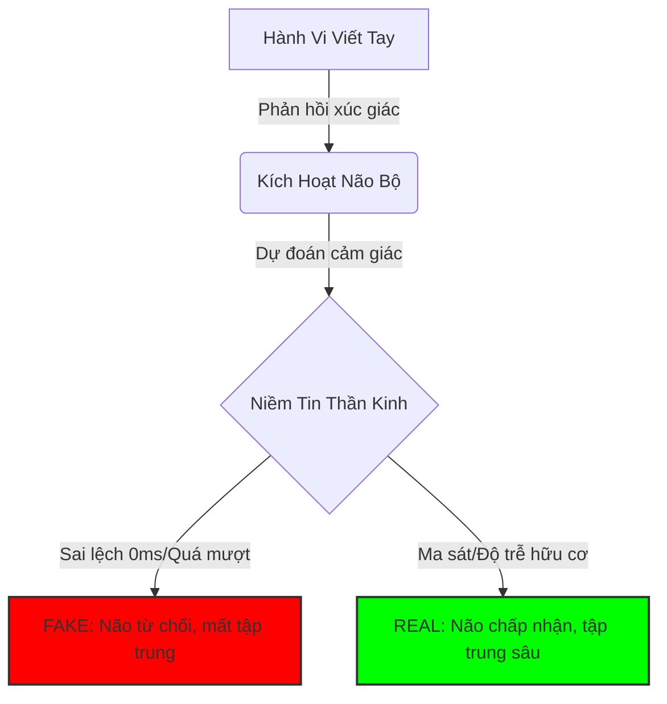
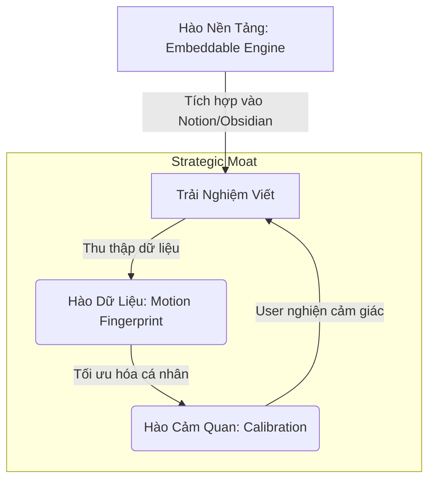
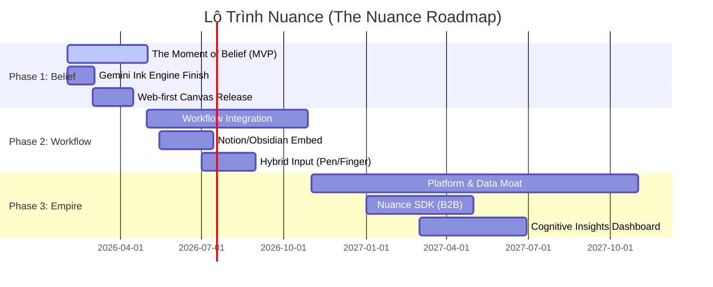

# 🚀 Nuance: Báo Cáo Nghiên Cứu Chuyên Sâu & Bản Đồ Chiến Lược
> **Mật danh**: TouchNote / Nuance
> **Mục Tiêu Tối Thượng**: Xây dựng "Hệ Điều Hành Của Chuyển Động Nhân Loại" (OS of Human Motion), khởi đầu bằng trải nghiệm viết tay hoàn hảo.

---

## 1. Tóm Tắt Điều Hành: Chiến Lược Một Trang (The One-Page Strategy)

> [!IMPORTANT]
> **Vấn Đề Cốt Lõi**: Các công cụ kỹ thuật số hiện tại tối ưu hóa cho **lưu trữ** và **tốc độ** (gõ phím), phớt lờ thực tế sinh học rằng tư duy con người bắt rễ từ **chuyển động** và **ma sát** (viết tay). Chúng ta đang đánh mất "kết cấu nhận thức" (cognitive texture) của suy nghĩ.

**Giải Pháp**: **Nuance** không chỉ là một ứng dụng ghi chú. Nó là một **Bộ Máy Vật Lý Cảm Quan (Sensory Physics Engine)** số hóa *cảm giác* viết trên giấy để mở khóa tư duy sâu, sau đó mở rộng thành nền tảng dữ liệu chuyển động của con người.

**Đại Dương Xanh**: **"Personal Cognitive Experience Platform"** (Nền tảng Trải nghiệm Nhận thức Cá nhân) — cầu nối giữa công cụ năng suất (Notion), công cụ sáng tạo (Procreate) và sức khỏe tinh thần (Headspace).

**Con Hào Chiến Lược (The Moat)**:
1.  🛡️ **Hào Cảm Quan**: Một "cỗ máy niềm tin" chân thực đến mức đánh lừa não bộ (khó sao chép nếu thiếu hiểu biết sâu về vật lý/thần kinh).
2.  🧬 **Hào Dữ Liệu**: Bộ dữ liệu lớn nhất thế giới về *chuyển động nhận thức* (ngập ngừng, áp lực, vận tốc) — không chỉ là nét mực tĩnh.

**Chiến Lược**:
*   **Ngắn hạn**: "Embedded Paper-like Engine" (Web-first/Đa nền tảng) để chiếm lấy nhóm người dùng bút cao cấp.
*   **Dài hạn**: "Nuance Engine" trở thành chuẩn mực cho mực kỹ thuật số (Licensing/B2B) và một "Biometric Data Corp".

---

## 2. Lớp 1 & 2: Nền Tảng Sinh Học (Tại Sao Điều Này Quan Trọng?)

### 🧠 Sự Thật Nhân Học
Viết tay không đơn thuần là ghi chép; nó là một **phanh hãm nhận thức (cognitive brake)**.
*   **Vòng Lặp Nhận Thức Ngoài**: Bàn tay đóng vai trò bộ xử lý ngoài cho não. Vòng lặp (Mắt ➔ Tay ➔ Giấy ➔ Mắt) tạo ra "ký ức vận động cảm giác" mà gõ phím phá vỡ.
*   **Sự Phù Hợp Tiến Hóa**: Não bộ tiến hóa để kiểm soát vận động tinh (chế tác công cụ). Viết tay "ký sinh" lên hệ mạch này.

### ⚡ Khoa Học Thần Kinh & Vật Lý Cảm Quan
Tại sao "Giống giấy" (Paper-like) lại quan trọng? Không phải vì hoài cổ; mà vì **Xử Lý Dự Đoán (Predictive Processing)**.
*   **Thung Lũng Kỳ Quái Của Mực**: Hầu hết các app bị mắc kẹt ở đây. Nhìn thì giống mực nhưng cảm giác như kính. Nuance vượt qua thung lũng này bằng cách mô phỏng *sự bất toàn* (rung động vi mô, mực loang, lực cản) để đạt được "Sự Tin Cậy Thần Kinh".
*   **Ma Sát = Tập Trung**: Một chút lực cản (drag) báo hiệu cho não rằng "công việc đang được thực hiện", huy động thêm tài nguyên thần kinh (sự chú ý).

---

## 3. Lớp 3: Thực Tế Thị Trường & Bản Đồ Đối Thủ (Competitor Map)

Chúng ta không chỉ chiến đấu với GoodNotes. Chúng ta chiến đấu giành **"Thị Phần Nhận Thức"**.

| Phân Khúc Đối Thủ | Ví Dụ Điển Hình | Họ Bán Gì? | Tại Sao Nuance Thắng? |
| :--- | :--- | :--- | :--- |
| **Tier 1: Sổ Tay Kỹ Thuật Số** | GoodNotes, Notability | "Sổ tay" (Lưu trữ, Tổ chức) | Họ bị bẫy trong ẩn dụ "App". Nuance bán *cảm giác* và *engine*. Nuance là Web-first/Đa nền tảng. |
| **Tier 2: Hệ Sinh Thái OS** | Apple Notes, Samsung Notes | Khóa chặt (Lock-in) | Tích hợp tốt nhưng trói buộc phần cứng. Nuance là "Keo Dính Đa Thiết Bị" cho người dùng power user. |
| **Tier 3: Canvas Vô Hạn** | Miro, Excalidraw, tldraw | Cộng tác (Whiteboard) | Tối ưu cho chuột & sơ đồ. Bút chỉ là phụ. Nuance biến Bút thành **Chính (Primary)**. |
| **Tier 4: Analog & Nghi Thức** | Moleskine, Thiền, Nhật ký | Sự An Yên, Tập Trung | Đây mới là đối thủ *thực sự*. Nuance thắng bằng cách mang lại sự *bình yên* của giấy + *quyền năng* của kỹ thuật số (search, undo, infinite space). |

> [!WARNING]
> **Khoảng Trống Thị Trường**: Chưa ai thống trị mảng "Viết Tay Độ Chính Xác Cao Đa Nền Tảng".
> *   **GoodNotes Web**: Còn hạn chế so với native app.
> *   **OneNote**: Nét mực "trôi nổi", giao diện quá công nghiệp.

---

## 4. Lớp 4: Sự Thật Phi Đồng Thuận (Góc Nhìn Ngược Dòng)

Đây là những niềm tin "ngược đời" nhưng đúng đắn của Nuance:

1.  🛑 **Độ trễ (Latency) không phải kẻ thù; sự *dự đoán được* mới là vua.** Não tha thứ cho độ trễ nếu nó hành xử giống lực cản vật lý. Chúng ta cần *vật lý nhất quán*, không cần 0ms.
2.  🐢 **"Năng suất" (Productivity) làm chúng ta ngu đi.** Tối ưu tốc độ (gõ phím) làm giảm mức độ hiểu. Nuance tối ưu cho *sự thấu hiểu* (sống chậm lại).
3.  💎 **Dữ liệu quý giá nhất là *vô hình*.** Không phải chữ bạn viết; mà là sự *ngập ngừng* trước khi viết, *áp lực* khi bạn căng thẳng. Nuance thu thập "Siêu dữ liệu Nhận thức" này.
4.  🦁 **User không muốn "Ghi chú tốt hơn"; họ muốn cảm thấy "Thông minh hơn".** Giá trị cốt lõi là sự tự tin về cảm xúc, không chỉ là tiện ích.

---

## 5. Lớp 5: Kỹ Thuật Xây Hào Chiến Lược (Moat Engineering)

Làm sao để phòng thủ khi Apple/Samsung thức tỉnh?

1.  🛡️ **Hào Cảm Quan (Calibration)**:
    *   Nuance là một "Nhạc cụ được cân chỉnh".
    *   **Hành động**: Xây dựng "Nghi thức Cân chỉnh" (Calibration Ritual) khi onboarding. App học độ nặng tay, tốc độ tay của user. Một khi đã quen, *dùng app khác sẽ thấy "sai"* (chi phí chuyển đổi cao).

2.  🧬 **Hào Dữ Liệu (Motion Fingerprint)**:
    *   Theo thời gian, Nuance xây dựng hồ sơ vận động độc nhất của user.
    *   Tính năng độc quyền: "Cảnh báo mệt mỏi" (chữ xấu đi), "Kích hoạt Flow State" (điều chỉnh vật lý mực theo tốc độ suy nghĩ).

3.  🏗️ **Hào Nền Tảng (Embeddable Engine)**:
    *   Nếu Nuance trở thành "Stripe cho Mực" (nhúng vào bất cứ đâu), nó trở thành hạ tầng.
    *   Đối thủ (Obsidian, Notion) trở thành *khách hàng*.

---

## 6. Lớp 6: Chiến Lược Đại Dương Xanh (Danh Mục "TouchNote")

**Danh Mục Mới**: **Personal Cognitive Experience Platform (PCE)**.

*   *Không phải* app ghi chú (quá nhỏ).
*   *Không phải* app đồ họa (quá phức tạp).
*   *Không phải* app sức khỏe (quá mềm).

### 🗺️ Strategy Canvas

| Yếu Tố | Đối Thủ Cũ (GoodNotes/OneNote) | **Nuance (TouchNote)** |
| :--- | :---: | :---: |
| Phức tạp giao diện | Cao | **Thấp (Biến mất)** |
| Tính năng "File/Folder" | Cao | **Thấp** |
| **Phản hồi Cảm quan (Haptics/Sound)** | Thấp | **Cực Đại** |
| **Đồng bộ Đa thiết bị (Cross-device)** | Trung bình | **Cực Đại** |
| **Phân tích Nhận thức (Insights)** | Không có | **Tiên Phong** |
| **Khả năng Nhúng (Embed)** | Thấp | **Tiên Phong** |

---

## 7. Lộ Trình Thực Thi: Từ MVP Đến Đế Chế

### 🚩 Phase 1: Khoảnh Khắc Của Niềm Tin (Hiện tại - 3 Tháng)
*   **Mục tiêu**: Chứng minh "Ink Engine" vượt trội hơn tất cả.
*   **Đối tượng**: "Người dùng Stylus bất mãn" (Người dùng iPad & Samsung ghét cảm giác "trượt trên kính").
*   **Sản phẩm**:
    *   Web-based Infinite Canvas (PWA).
    *   **Tính năng lõi**: Gemini Ink Engine (Độ nhớt, Âm thanh, Dự đoán, Áp lực).
    *   **Mũi khoan (Wedge)**: "Tờ giấy nháp tốt nhất Trái Đất." (Mở -> Viết -> Sướng -> Đóng).

### 🚩 Phase 2: Tích Hợp Quy Trình (3 - 9 Tháng)
*   **Mục tiêu**: Trở nên hữu ích, không chỉ "ngầu".
*   **Đối tượng**: Knowledge Workers, Sinh viên, Nhà nghiên cứu.
*   **Sản phẩm**:
    *   **"Embed/Iframe" Mode**: Thả bảng Nuance vào Notion/Obsidian.
    *   **Hybrid Input**: Bút để viết, Ngón tay để thao tác (Gesture Engine).
    *   **Cloud Sync**: "Bắt đầu trên Samsung, Kết thúc trên iPad."

### 🚩 Phase 3: Nền Tảng & Dữ Liệu (12+ Tháng)
*   **Mục tiêu**: Scale & Đào Hào.
*   **Sản phẩm**:
    *   **Nuance SDK**: Bán engine cho EdTech/Doanh nghiệp.
    *   **Cognitive Insights Dashboard**: "Bạn tập trung tốt hơn vào buổi sáng", "Hôm nay bạn đang stress."
    *   **Phần cứng phụ kiện**: Grip in 3D / Ngòi bút tùy chỉnh (Hào Vật Lý).

---
> **Hành Động Ngay (Kỹ Thuật)**:
> 1.  🚀 **Benchmark**: Đo độ trễ "Glass-to-Ink" trên Web vs Native (Phải <20ms cảm nhận).
> 2.  🎛️ **Physics Polish**: Tinh chỉnh "Sigmoid Curve" trong `pressureIntegration.ts` với dữ liệu thực tế.
> 3.  🔗 **Embed Test**: Tạo demo "Nuance Block" cho Notion/Obsidian để chứng minh chiến lược "Mũi khoan".
